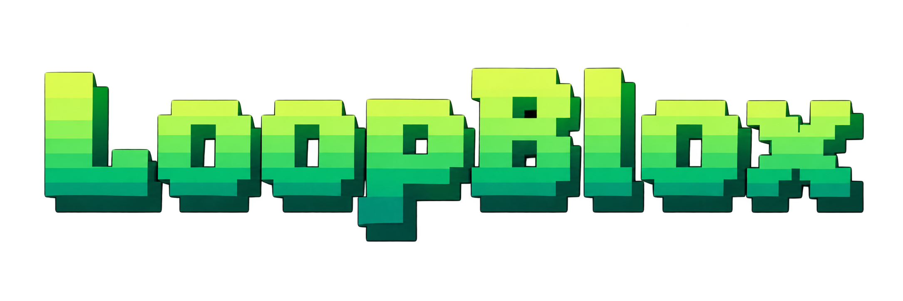

[Quick start](#quick-start) · [Visualize research](#visualize-your-experiment) · [Write a Loop](CONTROLLER.md) · [Components](COMPONENTS.md) · [Research protocol](experiment.md)

LoopBlox lets a Codex researcher edit an agent's Python loop and test each version on the same benchmark. It saves the source code, task traces, scores, and research notes from each iteration. The current prototype uses ten official **τ²-bench telecom** training tasks.

## A Loop is Python

This is the [shared baseline](controllers/reactive.py):

```python
def run(env):
    while True:
        context = env.component("context_full")
        decision = env.component("decide", context=context["id"])
        if decision["value"]["kind"] == "completion_proposed":
            return decision["value"]["response"]
        execution = env.component("execute", decision=decision["id"])
        env.component("observe_full", execution=execution["id"])
```

The researcher can change component order, add branches, and repeat calls using ordinary Python. LoopBlox provides [14 components](COMPONENTS.md); their behavior, the task model, and the scoring rules stay fixed during research. See the [controller API](CONTROLLER.md) to write a Loop.

## How research works


LoopBlox first runs the baseline on ten telecom tasks. Codex reviews the scores and traces, edits the Loop, and requests an evaluation on the same tasks.

LoopBlox keeps the best Loop by success rate, then cost. Codex saves its findings and tries the next change. This continues until you stop it. The [research protocol](experiment.md) defines evaluation and recovery rules.

## Quick start

You need **Python 3.12, Git, [uv](https://docs.astral.sh/uv/getting-started/installation/), and Docker** on macOS, Linux, or WSL2. Start Docker, clone the repository, and keep your terminal in its root directory for the steps below.

```sh
git clone https://github.com/chrischenhub/LoopBlox.git
cd LoopBlox
cp .env.example .env
```

### 1. Set up the services

Research uses three services. Codex edits Loops through your ChatGPT subscription. FreeInference runs the task agent and simulated user. Jev analyzes their task traces.

Follow the [installation guide](docs/running.md#install-the-host-dependencies) to install the benchmark environment, Jev SDK, and pinned Linux Codex distribution, then sign in to ChatGPT. Copy the two path assignments printed by setup into `.env` and set `FREEINFERENCE_API_KEY` and `TYPESAFE_API_KEY`. Paths must be absolute; `.env` does not expand `$HOME` or `$PWD`.

The guide also covers [other model providers](docs/running.md#host-configuration) and [login locations](docs/running.md#chatgpt-login). Research consumes service quota and continues until you stop it. Each task has [its own budget](experiment.md#limits-and-accounting).

### 2. Prepare tasks and start research

```sh
# Use the benchmark's Python environment
source .artifacts/upstream/tau2-bench/.venv/bin/activate

# Prepare ten training tasks; this does not call models
python -B -m loopblox.benchmarks.run_tau2 \
  prepare --output .artifacts/tau2/telecom-suite-NEW --seed 20260921

# Evaluate the baseline, then start the researcher
python -B -m loopblox.benchmarks.run_tau2 \
  run --suite .artifacts/tau2/telecom-suite-NEW --output .artifacts/tau2/research-NEW
```

Choose unused output directory names and a seed for your run. `run` stays in the foreground; leave that terminal open while research is running.

### 3. Check progress and stop

In a second terminal, from the same repository root:

```sh
python3 -B -m loopblox.benchmarks.run_tau2 status --output .artifacts/tau2/research-NEW
```

To stop research, press Ctrl-C in the running terminal or use:

```sh
python3 -B -m loopblox.benchmarks.run_tau2 stop --output .artifacts/tau2/research-NEW
```

Wait for worker cleanup to finish. Completed results and usage remain on disk. After an infrastructure failure, follow the [recovery instructions](docs/running.md#run-stop-and-recover) to start a new attempt with the completed evidence and prior spend preserved.

## Inspect a run

The campaign saves its files under the directory you passed to `--output`:

```text
research-NEW/
├── report.md                   # Scores and usage, refreshed by status
├── status.json                 # Current state in JSON
└── research/
    ├── selected-controller.py  # Best fully evaluated Loop
    └── public/
        ├── notes.md            # Researcher's notebook
        ├── checkpoints/        # Saved iterations
        └── evaluations/        # Task traces, scores, and Jev analysis
```

`selected-controller.py` appears once a Loop has been fully evaluated. The researcher writes its notebook as it works. The example paths keep these records in Git-ignored `.artifacts/`; keep the campaign directory to retain them.

## Visualize your experiment

Generate a standalone HTML report from a running or completed campaign:

```sh
python3 -B -m loopblox.research.visualize .artifacts/tau2/research-NEW \
  --output .artifacts/visualizations/research-NEW.html
```

Open the HTML in a browser to compare Loop versions, read source changes, and inspect one task's recorded component calls. The report also shows evaluation scores and agent model usage. Run the command again to refresh it as research progresses; generating a report makes no model calls. The [visualization guide](docs/running.md#visualize-a-research-campaign) covers task selection and accounting.

## Try the local playground

The playground needs the task-model gateway and Docker. With `FREEINFERENCE_API_KEY` set in `.env` and Docker running:

```sh
docker pull python:3.12-slim
python3 -B -m loopblox.chat serve
```

Open http://127.0.0.1:8766/ to chat and watch the baseline's component calls. Each message uses the model service. See the [playground guide](site/README.md#local-chat-and-loop-view) for limits and saved traces.

## Find your way around the code

| File | What it does |
| --- | --- |
| [controllers/reactive.py](controllers/reactive.py) | The baseline task Loop. |
| [runtime/components.py](loopblox/runtime/components.py) | Component behavior, parameters, and fixed prompts. |
| [research/session.py](loopblox/research/session.py) | Candidate evaluations, selection, and iteration checkpoints. |
| [research/campaign.py](loopblox/research/campaign.py) | Task limits, frozen run settings, stopping, and recovery. |
| [benchmarks/tau2.py](loopblox/benchmarks/tau2.py) | Task preparation and integration with the official τ² environment and evaluator. |

The [concept guide](loop.md) defines Loops and components. [Running research](docs/running.md) covers setup and operation; the [protocol](experiment.md) defines evaluation rules. Read [AGENTS.md](AGENTS.md) before changing the implementation.

[MIT license](LICENSE). Benchmark sources and bundled font licenses are documented in [Sources and licenses](docs/sources.md).
