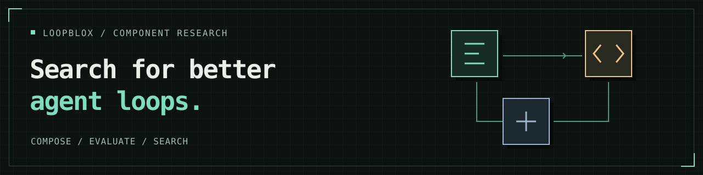
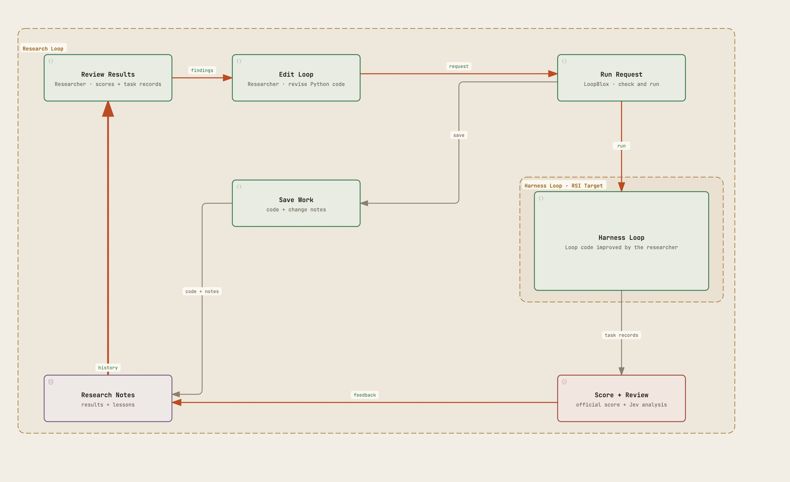

# LoopBlox



[Quick start](#quick-start) · [Write a Loop](CONTROLLER.md) · [Components](COMPONENTS.md) · [Research protocol](experiment.md)

LoopBlox is an open-source research environment for composing agent behavior in Python and letting a research agent improve Loops on the same benchmark. Evaluate complete task outcomes and costs while keeping the tasks, model, tools, and component contracts fixed.

**Research prototype.** The active benchmark is **τ²-bench telecom**, using ten audited official training tasks with deterministic scoring.

**Native Codex is the default researcher.** It analyzes approved public evidence and requests candidate evaluations through the research host. The host runs tasks, completes Jev analysis, and selects the best fully evaluated Loop. See [researcher setup](docs/running.md#native-codex-researcher).

The [research protocol](experiment.md) defines continuous improvement on one frozen task set. Each iteration carries its evidence and notes into the next. Research continues until the user stops it; infrastructure failures follow the recorded recovery procedure.

## A Loop is Python

This is the [shared baseline](controllers/reactive.py):

```python
def run(env):
    while True:
        context = env.component("context_full")
        decision = env.component("decide", context=context["id"])
        if decision["value"]["kind"] == "completion_proposed":
            return decision["value"]["response"]
        execution = env.component("execute", decision=decision["id"])
        env.component("observe_full", execution=execution["id"])
```

A Loop chooses component order, repetition, branches, and exposed options using ordinary Python. The host owns model and tool access, isolation, budgets, and scoring. The outer `run(env)` return ends the controller; scoring follows after its worker closes.

The [14 components](COMPONENTS.md) cover context and evidence, proposals, assessment, and actions. Examples for human readers include [working through plan steps](controllers/scoped_plan.py), [comparing decision proposals](controllers/compared_work.py), [reviewing completion](controllers/planned_work.py), and [reflecting after tool failures](controllers/failure_reflection.py). These alternative Loops are not supplied to the researcher. Context can retain a summary while adding new evidence, and brief observations can be paged or expanded to their original full result. The `judge` component uses Jev for caller-defined yes/no judgments and classification; questions and category descriptions are editable while evidence access and output types stay fixed. See [Judge usage](CONTROLLER.md#judge-online-typed-judgments). Contracts live in [components.py](loopblox/runtime/components.py); the catalog is generated from that source.

## How research works



The outer **Research Loop** is the researcher's cycle of inspecting evidence, editing Python, and requesting evaluations. The inner **Harness Loop — RSI Target** is the candidate task Loop: the `run(env)` code being improved. LoopBlox validates requests and executes that code through the fixed host and component library. Official scores and Jev analysis feed the next round of investigation; saved code, change rationales, and research notes preserve what was tried. Model weights and the host's scoring rules stay fixed.

1. Freeze ten official telecom training tasks, the component boundary, baseline, model settings and task limits. Run the baseline once on all ten tasks, with official scoring and [Jev analysis](docs/jev.md).
2. Let the researcher inspect the evidence and save one new Loop by default, at most two per iteration. Each saved Loop runs on all ten tasks with fresh environments. Two candidates therefore require twenty new task runs; the baseline's recorded results are reused.
3. Complete mandatory Jev analysis after every task run. The host ranks fully evaluated Loops by official success rate, then agent input tokens, then agent model calls. A full tie retains the current best Loop.
4. Checkpoint once every candidate saved in the iteration has complete scores and analysis. Preserve the hypothesis, evidence, failed approaches and next direction, then continue research.

Search changes Python compositions; model weights stay fixed. Task execution is serial, with an isolated worker for each run. Per-task budgets apply; the shared research budget and iteration count are uncapped. Stopping preserves the current best fully evaluated Loop and does not dispatch test tasks. [experiment.md](experiment.md) owns the detailed rules, including infrastructure recovery; [running.md](docs/running.md#run-stop-and-recover) provides the commands.

## Quick start

Use a macOS or Linux host, or a Linux shell under WSL2, with **Git, Python 3.12, [uv](https://docs.astral.sh/uv/getting-started/installation/), and Docker Engine**. Start Docker before running tasks. All commands below run from the repository root; LoopBlox runs directly from source.

```sh
git clone https://github.com/chrischenhub/LoopBlox.git
cd LoopBlox

# Inspect the API and commands without calling models
python3 -B -m loopblox.runtime.components --markdown
python3 -B -m loopblox.benchmarks.run_tau2 --help
```

### 1. Install and configure research services

```sh
cp .env.example .env
```

Follow the [installation guide](docs/running.md#install-the-host-dependencies) to install the pinned benchmark environment and Jev SDK, pull the worker image, and download the Linux Codex distribution for your Docker architecture. It includes [Codex download, login, and verification commands](docs/running.md#native-codex-researcher).

Edit `.env` with your own credentials and the absolute paths produced by setup:

| Setting | Used for |
| --- | --- |
| `FREEINFERENCE_API_KEY` | Task-agent and simulated-user calls through the default gateway. [OpenCode Go](docs/running.md#host-configuration) is also supported. |
| `TYPESAFE_API_KEY` | Mandatory post-run Jev analysis and the optional online `judge` component. |
| `LOOPBLOX_JEV_PYTHON` | The interpreter containing the Jev SDK, if installed separately from the benchmark environment. |
| `LOOPBLOX_CODEX_BINARY_ROOT` | The complete pinned Linux Codex distribution, including its Code Mode host. |
| `LOOPBLOX_CODEX_AUTH_FILE` | Optional path to a ChatGPT login file; see [authentication setup](docs/running.md#chatgpt-login). |

The template lists model and provider overrides. `.env` values are read literally: use absolute paths instead of `$PWD` or `$HOME`. Process environment variables take precedence. Keep credentials in the ignored `.env` and the external login file.

### 2. Prepare tasks and start research

```sh
# Prepare ten training tasks; this does not call models
.artifacts/upstream/tau2-bench/.venv/bin/python -B -m loopblox.benchmarks.run_tau2 \
  prepare --output .artifacts/tau2/telecom-suite-NEW --seed 20260921

# Start research; this uses model services and your Codex subscription
.artifacts/upstream/tau2-bench/.venv/bin/python -B -m loopblox.benchmarks.run_tau2 \
  run --suite .artifacts/tau2/telecom-suite-NEW --output .artifacts/tau2/research-NEW
```

Choose unused output directory names for each preparation and campaign. The seed above is an example; record your chosen seed. `run` stays in the foreground, evaluates the baseline on all ten tasks, then starts continuous research. There is no automatic iteration limit; keep the process running until you stop it. Task, simulated-user, and Jev calls consume their configured services' quota.

### 3. Inspect, stop, or recover

In a second terminal, from the same repository root:

```sh
python3 -B -m loopblox.benchmarks.run_tau2 status --output .artifacts/tau2/research-NEW
python3 -B -m loopblox.benchmarks.run_tau2 stop --output .artifacts/tau2/research-NEW
```

`status` refreshes the campaign's `report.md` and `status.json`. The current best fully evaluated source is `research/selected-controller.py` inside that campaign directory. [Output navigation](docs/running.md#inspect-campaign-outputs) lists the notes, checkpoints, task traces, and analysis records.

`stop`, or Ctrl-C in the running terminal, interrupts research and waits for cleanup while preserving results and usage. After an infrastructure failure, diagnose it and use the [recovery command](docs/running.md#run-stop-and-recover) with a new output directory and a recorded reason. Recovery preserves completed evidence and prior spend; a user-stopped campaign is not eligible for that command.

### Try the local playground

To explore the baseline without setting up a benchmark or researcher, configure the model gateway in `.env`, start Docker, and run:

```sh
docker pull python:3.12-slim
python3 -B -m loopblox.chat serve
```

Open http://127.0.0.1:8766/ for a local chat with a view of the reactive Loop and its recorded calls. This uses the task model service. The [playground guide](site/README.md#local-chat-and-loop-view) describes its read-only tools, per-message limits, and saved traces.

## Scope and local records

Retired protocols, historical reports and source snapshots are kept locally in the Git-ignored `archive/` directory. Original campaign evidence and frozen implementations remain in `.artifacts/`. Neither directory is included in a fresh clone. Historical results belong to their original protocols and do not validate the current continuous workflow.

SpreadsheetBench 2 modeling/debugging is the next benchmark direction. It and Terminal-Bench are not integrated; TextWorld is retired.

## Explore

| Start here | What you'll find |
| --- | --- |
| [Controller API](CONTROLLER.md) / [examples](controllers/) | Write and compose Loops. |
| [Concepts](loop.md) / [component contracts](COMPONENTS.md) | Definitions, boundaries, and available operations. |
| [Research protocol](experiment.md) | Continuous Loop improvement on one frozen benchmark. |
| [τ² setup](docs/running.md) | Environment setup, task preparation, continuous runs and recovery. |
| [Jev analysis](docs/jev.md) | Fixed post-run segment measurements, researcher feedback, setup and usage. |
| [Native Codex setup](docs/running.md#native-codex-researcher) | Default researcher configuration and access boundary. |
| [Implementation](loopblox/) / [conditions](experiments/) | Runtime and research code; experiment configuration. |
| [Website](site/README.md) | Build the read-only visual introduction. |
| [Engineering policy](AGENTS.md) | Isolation, accounting, freezing, and recovery rules. |

[MIT license](LICENSE). Benchmark sources and bundled font licenses are documented in [Sources and licenses](docs/sources.md).
